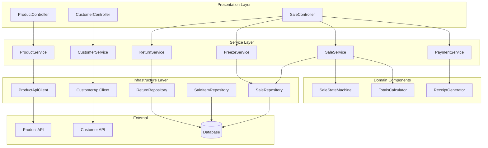
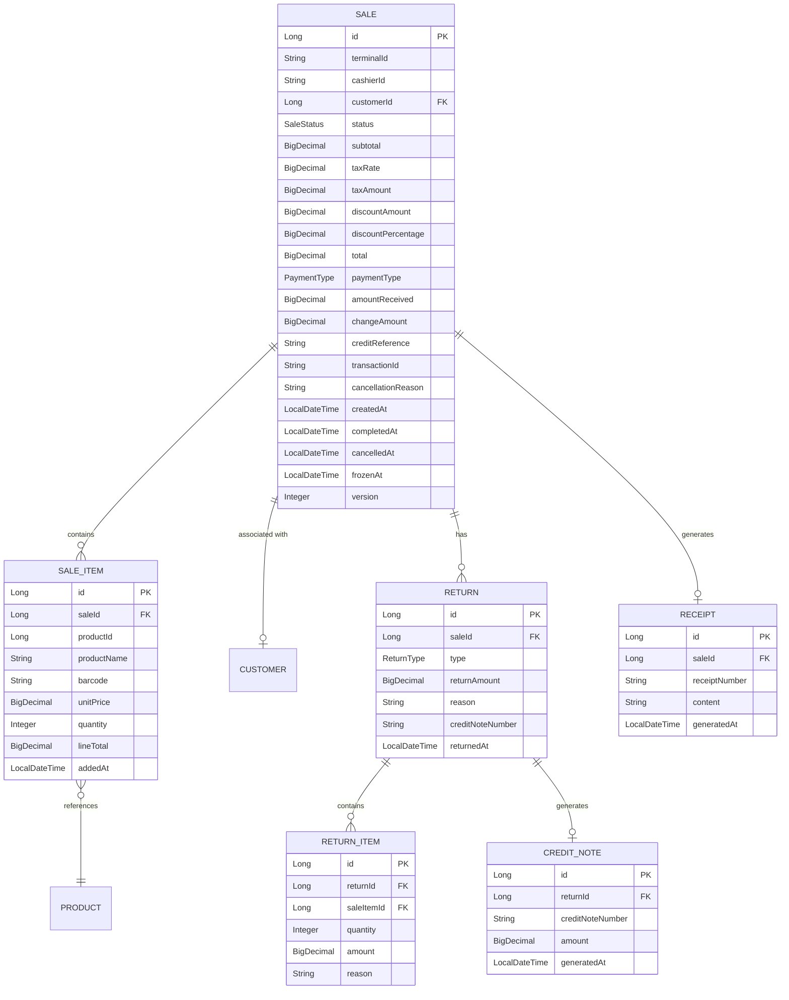
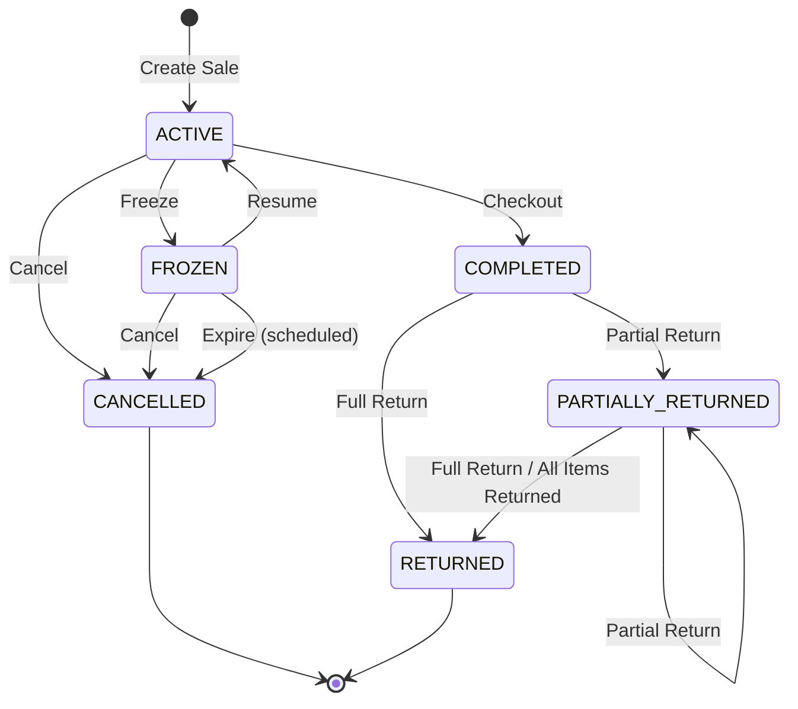

# Design Document: Supermarket POS Sales API

## Overview

The Supermarket POS Sales API is a RESTful service that manages the complete lifecycle of sales transactions for supermarket Point of Sale (POS) terminals. The API handles sale creation, item management, payment processing (cash and credit), freezing/resuming transactions, cancellation, and returns (full and partial).

### System Goals

- Provide a reliable, transactional sales management system for POS terminals
- Ensure accurate monetary calculations and inventory synchronization
- Support flexible transaction workflows including pause/resume and returns
- Integrate seamlessly with external Product and Customer APIs
- Maintain data integrity across all operations

### Key Design Decisions

| Decision | Rationale |
|----------|-----------|
| Spring Boot 3.x with Java 17+ | Modern framework with virtual threads support, Jakarta EE 9+, and GraalVM native compilation |
| BigDecimal for monetary values | Precise financial calculations avoiding floating-point errors |
| State pattern for sale lifecycle | Clear state transitions with validation at each step |
| Resilience4j for external API calls | Circuit breaker, retry, and timeout patterns for fault tolerance |
| Optimistic locking for concurrency | Handle concurrent modifications to sales safely |
| Event-driven stock updates | Decouple stock operations with compensation on failures |

### Scope

**In Scope:**
- Sale CRUD operations and lifecycle management
- Item management within sales
- Payment processing (cash and credit)
- Freeze/resume functionality
- Full and partial returns
- Receipt generation
- External API integration (Product API, Customer API)

**Out of Scope:**
- Authentication and authorization (assumed handled at API gateway)
- Product catalog management (owned by Product API)
- Customer records management (owned by Customer API)
- Physical POS terminal hardware integration
- Payment gateway integration for credit card processing

---

## Architecture

### High-Level Architecture

```
┌─────────────────────────────────────────────────────────────────────────────┐
│                           POS Terminal Client                                │
└─────────────────────────────────────────────────────────────────────────────┘
                                      │
                                      ▼
┌─────────────────────────────────────────────────────────────────────────────┐
│                              API Gateway / LB                                │
│                        (Authentication, Rate Limiting)                       │
└─────────────────────────────────────────────────────────────────────────────┘
                                      │
                                      ▼
┌─────────────────────────────────────────────────────────────────────────────┐
│                           Sales API Application                              │
│  ┌─────────────────┐  ┌─────────────────┐  ┌─────────────────┐              │
│  │   Controller    │  │   Controller    │  │   Controller    │              │
│  │     Layer       │  │     Layer       │  │     Layer       │              │
│  └─────────────────┘  └─────────────────┘  └─────────────────┘              │
│          │                    │                    │                        │
│          └────────────────────┼────────────────────┘                        │
│                               ▼                                             │
│  ┌─────────────────────────────────────────────────────────────────────┐   │
│  │                        Service Layer                                  │   │
│  │  ┌───────────────┐ ┌───────────────┐ ┌───────────────┐              │   │
│  │  │  SaleService  │ │PaymentService │ │ ReturnService │              │   │
│  │  └───────────────┘ └───────────────┘ └───────────────┘              │   │
│  └─────────────────────────────────────────────────────────────────────┘   │
│                               │                                             │
│          ┌────────────────────┼────────────────────┐                       │
│          ▼                    ▼                    ▼                       │
│  ┌───────────────┐  ┌───────────────┐  ┌───────────────┐                   │
│  │Repository Layer│  │External Clients│  │  Components   │                   │
│  │  (Spring Data) │  │ (Resilience4j) │  │ (State, Calc) │                   │
│  └───────────────┘  └───────────────┘  └───────────────┘                   │
└─────────────────────────────────────────────────────────────────────────────┘
          │                    │                    │
          ▼                    ▼                    ▼
┌─────────────────┐  ┌─────────────────┐  ┌─────────────────┐
│    Database     │  │   Product API   │  │  Customer API   │
│  (H2/PostgreSQL)│  │   (External)    │  │   (External)    │
└─────────────────┘  └─────────────────┘  └─────────────────┘
```

### Component Architecture



### Technology Stack

| Layer | Technology | Purpose |
|-------|------------|---------|
| Web Framework | Spring Boot 3.x | REST API framework |
| Build Tool | Maven/Gradle | Dependency management and build |
| ORM | Spring Data JPA / Hibernate | Database access |
| Validation | Jakarta Bean Validation | Input validation |
| HTTP Client | RestTemplate / WebClient | External API calls |
| Resilience | Resilience4j | Circuit breaker, retry, timeout |
| Database (Dev/Test) | H2 | In-memory database |
| Database (Production) | PostgreSQL | Persistent storage |
| API Documentation | SpringDoc OpenAPI | Swagger UI generation |
| State Machine | Custom (Spring State Machine optional) | Sale lifecycle management |

---

## Components and Interfaces

### Controller Layer

#### ProductController

Responsible for product search operations proxied through the Product API.

```java
@RestController
@RequestMapping("/api/v1/products")
@Tag(name = "Product Search", description = "Product search operations")
public interface ProductController {
    
    @GetMapping("/search")
    ResponseEntity<List<ProductSummary>> searchProducts(
        @RequestParam(required = false) String name,
        @RequestParam(required = false) String barcode
    );
}
```

#### CustomerController

Responsible for customer search operations proxied through the Customer API.

```java
@RestController
@RequestMapping("/api/v1/customers")
@Tag(name = "Customer Search", description = "Customer search operations")
public interface CustomerController {
    
    @GetMapping("/search")
    ResponseEntity<List<CustomerSummary>> searchCustomers(
        @RequestParam(required = false) String name,
        @RequestParam(required = false) String documentNumber
    );
}
```

#### SaleController

Main controller for sale lifecycle operations.

```java
@RestController
@RequestMapping("/api/v1/sales")
@Tag(name = "Sales", description = "Sale lifecycle operations")
public interface SaleController {
    
    @PostMapping
    ResponseEntity<SaleResponse> createSale(@Valid @RequestBody CreateSaleRequest request);
    
    @GetMapping("/{saleId}")
    ResponseEntity<SaleResponse> getSale(@PathVariable Long saleId);
    
    @PostMapping("/{saleId}/items")
    ResponseEntity<SaleResponse> addItem(
        @PathVariable Long saleId,
        @Valid @RequestBody AddItemRequest request
    );
    
    @PutMapping("/{saleId}/items/{itemId}")
    ResponseEntity<SaleResponse> updateItemQuantity(
        @PathVariable Long saleId,
        @PathVariable Long itemId,
        @Valid @RequestBody UpdateItemRequest request
    );
    
    @DeleteMapping("/{saleId}/items/{itemId}")
    ResponseEntity<SaleResponse> removeItem(
        @PathVariable Long saleId,
        @PathVariable Long itemId
    );
    
    @PostMapping("/{saleId}/checkout")
    ResponseEntity<CheckoutResponse> checkout(
        @PathVariable Long saleId,
        @Valid @RequestBody CheckoutRequest request
    );
    
    @PostMapping("/{saleId}/cancel")
    ResponseEntity<SaleResponse> cancelSale(
        @PathVariable Long saleId,
        @Valid @RequestBody CancelRequest request
    );
    
    @PostMapping("/{saleId}/freeze")
    ResponseEntity<SaleResponse> freezeSale(@PathVariable Long saleId);
    
    @PostMapping("/{saleId}/resume")
    ResponseEntity<SaleResponse> resumeSale(@PathVariable Long saleId);
    
    @GetMapping("/frozen")
    ResponseEntity<List<SaleSummary>> getFrozenSales(
        @RequestParam String terminalId
    );
    
    @PostMapping("/{saleId}/returns/full")
    ResponseEntity<ReturnResponse> processFullReturn(
        @PathVariable Long saleId,
        @Valid @RequestBody FullReturnRequest request
    );
    
    @PostMapping("/{saleId}/returns/partial")
    ResponseEntity<ReturnResponse> processPartialReturn(
        @PathVariable Long saleId,
        @Valid @RequestBody PartialReturnRequest request
    );
    
    @PutMapping("/{saleId}/discount")
    ResponseEntity<SaleResponse> applyDiscount(
        @PathVariable Long saleId,
        @Valid @RequestBody DiscountRequest request
    );
    
    @PutMapping("/{saleId}/customer")
    ResponseEntity<SaleResponse> associateCustomer(
        @PathVariable Long saleId,
        @Valid @RequestBody CustomerAssociationRequest request
    );
}
```

### Service Layer

#### ProductService

```java
public interface ProductService {
    
    /**
     * Search products by name (partial, case-insensitive) or barcode (exact match).
     * 
     * @param name Product name to search (optional)
     * @param barcode Product barcode to search (optional)
     * @return List of matching products
     * @throws ExternalServiceException if Product API is unavailable
     */
    List<ProductSummary> searchProducts(String name, String barcode);
}
```

#### CustomerService

```java
public interface CustomerService {
    
    /**
     * Search customers by name (partial match) or document number (exact match).
     * 
     * @param name Customer name to search (optional)
     * @param documentNumber Document number to search (optional)
     * @return List of matching customers
     * @throws ExternalServiceException if Customer API is unavailable
     */
    List<CustomerSummary> searchCustomers(String name, String documentNumber);
    
    /**
     * Retrieve customer details by ID.
     * 
     * @param customerId Customer identifier
     * @return Customer details
     * @throws CustomerNotFoundException if customer does not exist
     * @throws ExternalServiceException if Customer API is unavailable
     */
    CustomerDetails getCustomer(Long customerId);
    
    /**
     * Verify customer credit status for credit sales.
     * 
     * @param customerId Customer identifier
     * @return Credit status (APPROVED, REJECTED, PENDING)
     * @throws ExternalServiceException if Customer API is unavailable
     */
    CreditStatus verifyCreditStatus(Long customerId);
}
```

#### SaleService

```java
public interface SaleService {
    
    Sale createSale(CreateSaleCommand command);
    Sale getSale(Long saleId);
    Sale addItem(Long saleId, AddItemCommand command);
    Sale updateItemQuantity(Long saleId, Long itemId, int quantity);
    Sale removeItem(Long saleId, Long itemId);
    Sale applyDiscount(Long saleId, ApplyDiscountCommand command);
    Sale associateCustomer(Long saleId, Long customerId);
    Sale cancelSale(Long saleId, CancelSaleCommand command);
    List<Sale> getFrozenSalesByTerminal(String terminalId);
}
```

#### PaymentService

```java
public interface PaymentService {
    
    /**
     * Process checkout for a sale.
     * 
     * @param saleId Sale identifier
     * @param request Checkout request with payment details
     * @return Checkout result with receipt and transaction ID
     * @throws SaleNotFoundException if sale does not exist
     * @throws InvalidSaleStateException if sale is not in ACTIVE status
     * @throws InsufficientStockException if any item lacks stock
     * @throws PaymentValidationException if payment validation fails
     * @throws ExternalServiceException if external APIs are unavailable
     */
    CheckoutResult checkout(Long saleId, CheckoutRequest request);
}
```

#### ReturnService

```java
public interface ReturnService {
    
    /**
     * Process a full return for a completed sale.
     * 
     * @param saleId Sale identifier
     * @param request Full return request with reason
     * @return Return result with credit note or refund details
     */
    ReturnResult processFullReturn(Long saleId, FullReturnCommand command);
    
    /**
     * Process a partial return for specific items.
     * 
     * @param saleId Sale identifier
     * @param request Partial return request with items and quantities
     * @return Return result with credit note or refund details
     */
    ReturnResult processPartialReturn(Long saleId, PartialReturnCommand command);
}
```

#### FreezeService

```java
public interface FreezeService {
    
    /**
     * Freeze an active sale.
     */
    Sale freezeSale(Long saleId);
    
    /**
     * Resume a frozen sale.
     */
    Sale resumeSale(Long saleId);
    
    /**
     * Find and cancel expired frozen sales.
     * Called by scheduled job.
     */
    int cancelExpiredFrozenSales();
}
```

### Domain Components

#### SaleStateMachine

Manages valid state transitions for sales.

```java
public enum SaleStatus {
    ACTIVE,
    COMPLETED,
    CANCELLED,
    FROZEN,
    RETURNED,
    PARTIALLY_RETURNED
}

public enum SaleEvent {
    FREEZE,
    RESUME,
    COMPLETE,
    CANCEL,
    PROCESS_FULL_RETURN,
    PROCESS_PARTIAL_RETURN
}

@Component
public class SaleStateMachine {
    
    private static final Map<SaleStatus, Set<SaleEvent>> ALLOWED_TRANSITIONS = Map.of(
        SaleStatus.ACTIVE, Set.of(SaleEvent.FREEZE, SaleEvent.COMPLETE, SaleEvent.CANCEL),
        SaleStatus.FROZEN, Set.of(SaleEvent.RESUME, SaleEvent.CANCEL),
        SaleStatus.COMPLETED, Set.of(SaleEvent.PROCESS_FULL_RETURN, SaleEvent.PROCESS_PARTIAL_RETURN),
        SaleStatus.PARTIALLY_RETURNED, Set.of(SaleEvent.PROCESS_PARTIAL_RETURN, SaleEvent.PROCESS_FULL_RETURN)
    );
    
    public boolean canTransition(SaleStatus current, SaleEvent event);
    public void validateTransition(SaleStatus current, SaleEvent event);
    public SaleStatus getTargetStatus(SaleEvent event);
}
```

#### TotalsCalculator

Handles all monetary calculations with precision.

```java
@Component
public class TotalsCalculator {
    
    private final BigDecimal taxRate;
    
    /**
     * Calculate sale totals from items.
     * 
     * @param items Sale items
     * @param discount Discount to apply (optional)
     * @return Calculated totals
     */
    public SaleTotals calculate(List<SaleItem> items, Discount discount);
    
    /**
     * Calculate line total for an item.
     */
    public BigDecimal calculateLineTotal(BigDecimal unitPrice, int quantity);
    
    /**
     * Calculate subtotal (sum of line totals).
     */
    public BigDecimal calculateSubtotal(List<SaleItem> items);
    
    /**
     * Calculate tax amount.
     */
    public BigDecimal calculateTax(BigDecimal subtotal);
    
    /**
     * Calculate discount amount.
     */
    public BigDecimal calculateDiscount(BigDecimal subtotal, Discount discount);
    
    /**
     * Calculate final total.
     */
    public BigDecimal calculateTotal(BigDecimal subtotal, BigDecimal tax, BigDecimal discount);
}
```

#### ReceiptGenerator

Generates receipts and credit notes.

```java
@Component
public class ReceiptGenerator {
    
    /**
     * Generate a checkout receipt.
     */
    public Receipt generateCheckoutReceipt(Sale sale, PaymentDetails payment);
    
    /**
     * Generate a return receipt.
     */
    public Receipt generateReturnReceipt(Sale sale, Return returnEntity);
    
    /**
     * Generate a credit note for credit sale returns.
     */
    public CreditNote generateCreditNote(Sale sale, Return returnEntity);
}
```

### Repository Layer

```java
@Repository
public interface SaleRepository extends JpaRepository<Sale, Long>, JpaSpecificationExecutor<Sale> {
    
    @Lock(LockModeType.OPTIMISTIC)
    Optional<Sale> findById(Long id);
    
    List<Sale> findByStatusAndTerminalIdOrderByCreatedAtDesc(SaleStatus status, String terminalId);
    
    List<Sale> findByStatusAndFrozenAtBefore(SaleStatus status, LocalDateTime threshold);
    
    @Query("SELECT s FROM Sale s WHERE s.status = :status AND s.terminalId = :terminalId ORDER BY s.frozenAt DESC")
    List<Sale> findFrozenByTerminal(@Param("status") SaleStatus status, @Param("terminalId") String terminalId);
    
    @Modifying
    @Query("UPDATE Sale s SET s.status = :status, s.cancelledAt = :cancelledAt, s.cancellationReason = :reason WHERE s.id = :id")
    int updateStatusToCancelled(@Param("id") Long id, @Param("status") SaleStatus status, 
                                 @Param("cancelledAt") LocalDateTime cancelledAt, @Param("reason") String reason);
}

@Repository
public interface SaleItemRepository extends JpaRepository<SaleItem, Long> {
    
    List<SaleItem> findBySaleId(Long saleId);
    
    Optional<SaleItem> findBySaleIdAndProductId(Long saleId, Long productId);
    
    @Modifying
    @Query("DELETE FROM SaleItem si WHERE si.sale.id = :saleId AND si.id = :itemId")
    int deleteBySaleIdAndItemId(@Param("saleId") Long saleId, @Param("itemId") Long itemId);
}

@Repository
public interface ReturnRepository extends JpaRepository<Return, Long> {
    
    List<Return> findBySaleId(Long saleId);
    
    @Query("SELECT COALESCE(SUM(ri.quantity), 0) FROM ReturnItem ri WHERE ri.saleItem.id = :saleItemId")
    int getTotalReturnedQuantityForItem(@Param("saleItemId") Long saleItemId);
}

@Repository
public interface ReceiptRepository extends JpaRepository<Receipt, Long> {
    
    Optional<Receipt> findBySaleId(Long saleId);
    
    Optional<Receipt> findByReceiptNumber(String receiptNumber);
}
```

### External API Clients

#### ProductApiClient

```java
@Component
public class ProductApiClient {
    
    private final RestTemplate restTemplate;
    private final CircuitBreaker circuitBreaker;
    private final Retry retry;
    
    @Value("${external.product-api.base-url}")
    private String baseUrl;
    
    @CircuitBreaker(name = "productApi", fallbackMethod = "searchProductsFallback")
    @Retry(name = "productApi")
    public List<ProductSummary> searchProducts(String name, String barcode);
    
    @CircuitBreaker(name = "productApi", fallbackMethod = "getProductFallback")
    @Retry(name = "productApi")
    public ProductDetails getProduct(Long productId);
    
    @CircuitBreaker(name = "productApi", fallbackMethod = "checkStockFallback")
    @Retry(name = "productApi")
    public StockInfo checkStock(Long productId);
    
    @CircuitBreaker(name = "productApi", fallbackMethod = "decrementStockFallback")
    @Retry(name = "productApi")
    public void decrementStock(List<StockAdjustment> adjustments);
    
    @CircuitBreaker(name = "productApi", fallbackMethod = "incrementStockFallback")
    @Retry(name = "productApi")
    public void incrementStock(List<StockAdjustment> adjustments);
}
```

#### CustomerApiClient

```java
@Component
public class CustomerApiClient {
    
    private final RestTemplate restTemplate;
    private final CircuitBreaker circuitBreaker;
    private final Retry retry;
    
    @Value("${external.customer-api.base-url}")
    private String baseUrl;
    
    @CircuitBreaker(name = "customerApi", fallbackMethod = "searchCustomersFallback")
    @Retry(name = "customerApi")
    public List<CustomerSummary> searchCustomers(String name, String documentNumber);
    
    @CircuitBreaker(name = "customerApi", fallbackMethod = "getCustomerFallback")
    @Retry(name = "customerApi")
    public CustomerDetails getCustomer(Long customerId);
    
    @CircuitBreaker(name = "customerApi", fallbackMethod = "verifyCreditStatusFallback")
    @Retry(name = "customerApi")
    public CreditStatus verifyCreditStatus(Long customerId);
}
```

---

## Data Models

### Entity Relationship Diagram



### Entity Definitions

#### Sale Entity

```java
@Entity
@Table(name = "sales")
public class Sale {
    
    @Id
    @GeneratedValue(strategy = GenerationType.IDENTITY)
    private Long id;
    
    @Column(name = "terminal_id", nullable = false)
    private String terminalId;
    
    @Column(name = "cashier_id", nullable = false)
    private String cashierId;
    
    @Column(name = "customer_id")
    private Long customerId;
    
    @Enumerated(EnumType.STRING)
    @Column(name = "status", nullable = false)
    private SaleStatus status = SaleStatus.ACTIVE;
    
    @Column(name = "subtotal", precision = 19, scale = 2, nullable = false)
    private BigDecimal subtotal = BigDecimal.ZERO;
    
    @Column(name = "tax_rate", precision = 5, scale = 4, nullable = false)
    private BigDecimal taxRate = new BigDecimal("0.19");
    
    @Column(name = "tax_amount", precision = 19, scale = 2, nullable = false)
    private BigDecimal taxAmount = BigDecimal.ZERO;
    
    @Column(name = "discount_amount", precision = 19, scale = 2)
    private BigDecimal discountAmount;
    
    @Column(name = "discount_percentage", precision = 5, scale = 2)
    private BigDecimal discountPercentage;
    
    @Column(name = "total", precision = 19, scale = 2, nullable = false)
    private BigDecimal total = BigDecimal.ZERO;
    
    @Enumerated(EnumType.STRING)
    @Column(name = "payment_type")
    private PaymentType paymentType;
    
    @Column(name = "amount_received", precision = 19, scale = 2)
    private BigDecimal amountReceived;
    
    @Column(name = "change_amount", precision = 19, scale = 2)
    private BigDecimal changeAmount;
    
    @Column(name = "credit_reference")
    private String creditReference;
    
    @Column(name = "transaction_id")
    private String transactionId;
    
    @Column(name = "cancellation_reason", length = 255)
    private String cancellationReason;
    
    @Column(name = "created_at", nullable = false, updatable = false)
    private LocalDateTime createdAt;
    
    @Column(name = "completed_at")
    private LocalDateTime completedAt;
    
    @Column(name = "cancelled_at")
    private LocalDateTime cancelledAt;
    
    @Column(name = "frozen_at")
    private LocalDateTime frozenAt;
    
    @Version
    private Integer version;
    
    @OneToMany(mappedBy = "sale", cascade = CascadeType.ALL, orphanRemoval = true)
    private List<SaleItem> items = new ArrayList<>();
    
    // Getters, setters, business methods
}
```

#### SaleItem Entity

```java
@Entity
@Table(name = "sale_items")
public class SaleItem {
    
    @Id
    @GeneratedValue(strategy = GenerationType.IDENTITY)
    private Long id;
    
    @ManyToOne(fetch = FetchType.LAZY)
    @JoinColumn(name = "sale_id", nullable = false)
    private Sale sale;
    
    @Column(name = "product_id", nullable = false)
    private Long productId;
    
    @Column(name = "product_name", nullable = false)
    private String productName;
    
    @Column(name = "barcode")
    private String barcode;
    
    @Column(name = "unit_price", precision = 19, scale = 2, nullable = false)
    private BigDecimal unitPrice;
    
    @Column(name = "quantity", nullable = false)
    private Integer quantity;
    
    @Column(name = "line_total", precision = 19, scale = 2, nullable = false)
    private BigDecimal lineTotal;
    
    @Column(name = "added_at", nullable = false, updatable = false)
    private LocalDateTime addedAt;
    
    // Getters, setters, business methods
}
```

#### Return Entity

```java
@Entity
@Table(name = "returns")
public class Return {
    
    @Id
    @GeneratedValue(strategy = GenerationType.IDENTITY)
    private Long id;
    
    @ManyToOne(fetch = FetchType.LAZY)
    @JoinColumn(name = "sale_id", nullable = false)
    private Sale sale;
    
    @Enumerated(EnumType.STRING)
    @Column(name = "type", nullable = false)
    private ReturnType type;
    
    @Column(name = "return_amount", precision = 19, scale = 2, nullable = false)
    private BigDecimal returnAmount;
    
    @Column(name = "reason", nullable = false)
    private String reason;
    
    @Column(name = "credit_note_number")
    private String creditNoteNumber;
    
    @Column(name = "returned_at", nullable = false)
    private LocalDateTime returnedAt;
    
    @OneToMany(mappedBy = "return", cascade = CascadeType.ALL)
    private List<ReturnItem> items = new ArrayList<>();
    
    // Getters, setters, business methods
}
```

#### ReturnItem Entity

```java
@Entity
@Table(name = "return_items")
public class ReturnItem {
    
    @Id
    @GeneratedValue(strategy = GenerationType.IDENTITY)
    private Long id;
    
    @ManyToOne(fetch = FetchType.LAZY)
    @JoinColumn(name = "return_id", nullable = false)
    private Return return_;
    
    @ManyToOne(fetch = FetchType.LAZY)
    @JoinColumn(name = "sale_item_id", nullable = false)
    private SaleItem saleItem;
    
    @Column(name = "quantity", nullable = false)
    private Integer quantity;
    
    @Column(name = "amount", precision = 19, scale = 2, nullable = false)
    private BigDecimal amount;
    
    @Column(name = "reason")
    private String reason;
    
    // Getters, setters, business methods
}
```

#### Receipt Entity

```java
@Entity
@Table(name = "receipts")
public class Receipt {
    
    @Id
    @GeneratedValue(strategy = GenerationType.IDENTITY)
    private Long id;
    
    @OneToOne(fetch = FetchType.LAZY)
    @JoinColumn(name = "sale_id", nullable = false, unique = true)
    private Sale sale;
    
    @Column(name = "receipt_number", nullable = false, unique = true)
    private String receiptNumber;
    
    @Column(name = "content", columnDefinition = "TEXT", nullable = false)
    private String content;
    
    @Column(name = "generated_at", nullable = false)
    private LocalDateTime generatedAt;
    
    // Getters, setters
}
```

### DTOs and Request/Response Models

```java
// Request DTOs
public record CreateSaleRequest(
    @NotBlank String terminalId,
    @NotBlank String cashierId,
    Long customerId
) {}

public record AddItemRequest(
    @NotNull Long productId,
    String barcode,
    @Min(1) int quantity
) {}

public record UpdateItemRequest(
    @Min(1) int quantity
) {}

public record CheckoutRequest(
    @NotNull PaymentType paymentType,
    BigDecimal amountReceived  // Required for CASH payments
) {}

public record CancelRequest(
    @NotBlank @Size(max = 255) String reason
) {}

public record DiscountRequest(
    BigDecimal percentage,
    BigDecimal fixedAmount
) {}

public record FullReturnRequest(
    @NotBlank String reason
) {}

public record PartialReturnRequest(
    @NotEmpty List<ReturnItemRequest> items
) {}

public record ReturnItemRequest(
    @NotNull Long saleItemId,
    @Min(1) int quantity,
    @NotBlank String reason
) {}

// Response DTOs
public record SaleResponse(
    Long id,
    String terminalId,
    String cashierId,
    CustomerInfo customer,
    SaleStatus status,
    List<SaleItemResponse> items,
    BigDecimal subtotal,
    BigDecimal taxRate,
    BigDecimal taxAmount,
    BigDecimal discountAmount,
    BigDecimal total,
    PaymentInfo payment,
    String transactionId,
    LocalDateTime createdAt,
    LocalDateTime completedAt
) {}

public record SaleItemResponse(
    Long id,
    Long productId,
    String productName,
    String barcode,
    BigDecimal unitPrice,
    int quantity,
    BigDecimal lineTotal
) {}

public record CheckoutResponse(
    SaleResponse sale,
    ReceiptResponse receipt,
    BigDecimal change
) {}

public record ReceiptResponse(
    String receiptNumber,
    String content
) {}

public record ReturnResponse(
    Long returnId,
    String creditNoteNumber,
    BigDecimal returnAmount,
    ReceiptResponse receipt
) {}

// External API DTOs
public record ProductSummary(
    Long id,
    String name,
    String barcode,
    BigDecimal unitPrice,
    Integer availableStock,
    String category
) {}

public record CustomerSummary(
    Long id,
    String fullName,
    String documentType,
    String documentNumber,
    CreditStatus creditStatus
) {}
```

---

## Database Schema

### Schema Definition (PostgreSQL)

```sql
-- Sales table
CREATE TABLE sales (
    id BIGSERIAL PRIMARY KEY,
    terminal_id VARCHAR(50) NOT NULL,
    cashier_id VARCHAR(50) NOT NULL,
    customer_id BIGINT,
    status VARCHAR(20) NOT NULL DEFAULT 'ACTIVE',
    subtotal DECIMAL(19,2) NOT NULL DEFAULT 0.00,
    tax_rate DECIMAL(5,4) NOT NULL DEFAULT 0.1900,
    tax_amount DECIMAL(19,2) NOT NULL DEFAULT 0.00,
    discount_amount DECIMAL(19,2),
    discount_percentage DECIMAL(5,2),
    total DECIMAL(19,2) NOT NULL DEFAULT 0.00,
    payment_type VARCHAR(20),
    amount_received DECIMAL(19,2),
    change_amount DECIMAL(19,2),
    credit_reference VARCHAR(50),
    transaction_id VARCHAR(50),
    cancellation_reason VARCHAR(255),
    created_at TIMESTAMP NOT NULL DEFAULT CURRENT_TIMESTAMP,
    completed_at TIMESTAMP,
    cancelled_at TIMESTAMP,
    frozen_at TIMESTAMP,
    version INTEGER NOT NULL DEFAULT 0
);

-- Sale items table
CREATE TABLE sale_items (
    id BIGSERIAL PRIMARY KEY,
    sale_id BIGINT NOT NULL REFERENCES sales(id) ON DELETE CASCADE,
    product_id BIGINT NOT NULL,
    product_name VARCHAR(255) NOT NULL,
    barcode VARCHAR(50),
    unit_price DECIMAL(19,2) NOT NULL,
    quantity INTEGER NOT NULL,
    line_total DECIMAL(19,2) NOT NULL,
    added_at TIMESTAMP NOT NULL DEFAULT CURRENT_TIMESTAMP
);

-- Returns table
CREATE TABLE returns (
    id BIGSERIAL PRIMARY KEY,
    sale_id BIGINT NOT NULL REFERENCES sales(id),
    type VARCHAR(20) NOT NULL,
    return_amount DECIMAL(19,2) NOT NULL,
    reason TEXT NOT NULL,
    credit_note_number VARCHAR(50),
    returned_at TIMESTAMP NOT NULL DEFAULT CURRENT_TIMESTAMP
);

-- Return items table
CREATE TABLE return_items (
    id BIGSERIAL PRIMARY KEY,
    return_id BIGINT NOT NULL REFERENCES returns(id) ON DELETE CASCADE,
    sale_item_id BIGINT NOT NULL REFERENCES sale_items(id),
    quantity INTEGER NOT NULL,
    amount DECIMAL(19,2) NOT NULL,
    reason VARCHAR(255)
);

-- Receipts table
CREATE TABLE receipts (
    id BIGSERIAL PRIMARY KEY,
    sale_id BIGINT NOT NULL REFERENCES sales(id),
    receipt_number VARCHAR(50) NOT NULL UNIQUE,
    content TEXT NOT NULL,
    generated_at TIMESTAMP NOT NULL DEFAULT CURRENT_TIMESTAMP
);

-- Credit notes table
CREATE TABLE credit_notes (
    id BIGSERIAL PRIMARY KEY,
    return_id BIGINT NOT NULL REFERENCES returns(id),
    credit_note_number VARCHAR(50) NOT NULL UNIQUE,
    amount DECIMAL(19,2) NOT NULL,
    generated_at TIMESTAMP NOT NULL DEFAULT CURRENT_TIMESTAMP
);

-- Indexes
CREATE INDEX idx_sales_terminal_status ON sales(terminal_id, status);
CREATE INDEX idx_sales_status_frozen ON sales(status, frozen_at);
CREATE INDEX idx_sales_customer ON sales(customer_id);
CREATE INDEX idx_sales_transaction ON sales(transaction_id);
CREATE INDEX idx_sale_items_sale ON sale_items(sale_id);
CREATE INDEX idx_sale_items_product ON sale_items(product_id);
CREATE INDEX idx_returns_sale ON returns(sale_id);
CREATE INDEX idx_return_items_return ON return_items(return_id);
CREATE INDEX idx_receipts_number ON receipts(receipt_number);
```

### H2 Configuration (Development/Test)

```yaml
# application-dev.yml
spring:
  datasource:
    url: jdbc:h2:mem:salesdb;DB_CLOSE_DELAY=-1;DB_CLOSE_ON_EXIT=FALSE
    driver-class-name: org.h2.Driver
    username: sa
    password: 
  h2:
    console:
      enabled: true
  jpa:
    database-platform: org.hibernate.dialect.H2Dialect
    hibernate:
      ddl-auto: create-drop
```

---

## Error Handling

### Exception Hierarchy

```java
// Base exception
public abstract class SalesApiException extends RuntimeException {
    private final String errorCode;
    
    public SalesApiException(String message, String errorCode) {
        super(message);
        this.errorCode = errorCode;
    }
    
    public SalesApiException(String message, String errorCode, Throwable cause) {
        super(message, cause);
        this.errorCode = errorCode;
    }
}

// Domain exceptions
public class SaleNotFoundException extends SalesApiException {
    public SaleNotFoundException(Long saleId) {
        super("Sale not found with id: " + saleId, "SALE_NOT_FOUND");
    }
}

public class InvalidSaleStateException extends SalesApiException {
    public InvalidSaleStateException(Long saleId, SaleStatus current, SaleStatus... expected) {
        super(String.format("Sale %d is in status %s, expected %s", 
            saleId, current, Arrays.toString(expected)), "INVALID_SALE_STATE");
    }
}

public class InsufficientStockException extends SalesApiException {
    private final List<StockIssue> issues;
    
    public InsufficientStockException(List<StockIssue> issues) {
        super("Insufficient stock for one or more items", "INSUFFICIENT_STOCK");
        this.issues = issues;
    }
}

public class PaymentValidationException extends SalesApiException {
    public PaymentValidationException(String message) {
        super(message, "PAYMENT_VALIDATION_ERROR");
    }
}

public class CreditStatusException extends SalesApiException {
    private final CreditStatus status;
    
    public CreditStatusException(CreditStatus status) {
        super("Customer credit status is not APPROVED: " + status, "CREDIT_STATUS_INVALID");
        this.status = status;
    }
}

// External service exceptions
public class ExternalServiceException extends SalesApiException {
    private final String serviceName;
    
    public ExternalServiceException(String serviceName, Throwable cause) {
        super(serviceName + " is temporarily unavailable", "SERVICE_UNAVAILABLE", cause);
        this.serviceName = serviceName;
    }
    
    public String getServiceName() { return serviceName; }
}

// Validation exceptions
public class ReturnValidationException extends SalesApiException {
    public ReturnValidationException(String message) {
        super(message, "RETURN_VALIDATION_ERROR");
    }
}
```

### Error Response Format

```java
public record ErrorResponse(
    @JsonFormat(shape = JsonFormat.Shape.STRING, pattern = "yyyy-MM-dd'T'HH:mm:ss.SSS")
    LocalDateTime{}
    LocalDateTime timestamp,
    int status,
    String error,
    String errorCode,
    String message,
    String path,
    List<FieldError> fieldErrors,
    Map<String, Object> details
) {}

public record FieldError(
    String field,
    String message,
    Object rejectedValue
) {}

public record StockIssue(
    Long productId,
    String productName,
    int requestedQuantity,
    int availableQuantity
) {}
```

### Global Exception Handler

```java
@RestControllerAdvice
public class GlobalExceptionHandler {
    
    @ExceptionHandler(SaleNotFoundException.class)
    public ResponseEntity<ErrorResponse> handleSaleNotFound(SaleNotFoundException ex, HttpServletRequest request) {
        ErrorResponse response = new ErrorResponse(
            LocalDateTime.now(),
            HttpStatus.NOT_FOUND.value(),
            "Not Found",
            ex.getErrorCode(),
            ex.getMessage(),
            request.getRequestURI(),
            null,
            null
        );
        return ResponseEntity.status(HttpStatus.NOT_FOUND).body(response);
    }
    
    @ExceptionHandler(InvalidSaleStateException.class)
    public ResponseEntity<ErrorResponse> handleInvalidSaleState(InvalidSaleStateException ex, HttpServletRequest request) {
        ErrorResponse response = new ErrorResponse(
            LocalDateTime.now(),
            HttpStatus.BAD_REQUEST.value(),
            "Bad Request",
            ex.getErrorCode(),
            ex.getMessage(),
            request.getRequestURI(),
            null,
            null
        );
        return ResponseEntity.status(HttpStatus.BAD_REQUEST).body(response);
    }
    
    @ExceptionHandler(InsufficientStockException.class)
    public ResponseEntity<ErrorResponse> handleInsufficientStock(InsufficientStockException ex, HttpServletRequest request) {
        ErrorResponse response = new ErrorResponse(
            LocalDateTime.now(),
            HttpStatus.CONFLICT.value(),
            "Conflict",
            ex.getErrorCode(),
            ex.getMessage(),
            request.getRequestURI(),
            null,
            Map.of("stockIssues", ex.getIssues())
        );
        return ResponseEntity.status(HttpStatus.CONFLICT).body(response);
    }
    
    @ExceptionHandler(PaymentValidationException.class)
    public ResponseEntity<ErrorResponse> handlePaymentValidation(PaymentValidationException ex, HttpServletRequest request) {
        ErrorResponse response = new ErrorResponse(
            LocalDateTime.now(),
            HttpStatus.BAD_REQUEST.value(),
            "Bad Request",
            ex.getErrorCode(),
            ex.getMessage(),
            request.getRequestURI(),
            null,
            null
        );
        return ResponseEntity.status(HttpStatus.BAD_REQUEST).body(response);
    }
    
    @ExceptionHandler({CreditStatusException.class, ReturnValidationException.class})
    public ResponseEntity<ErrorResponse> handleUnprocessableEntity(SalesApiException ex, HttpServletRequest request) {
        ErrorResponse response = new ErrorResponse(
            LocalDateTime.now(),
            HttpStatus.UNPROCESSABLE_ENTITY.value(),
            "Unprocessable Entity",
            ex.getErrorCode(),
            ex.getMessage(),
            request.getRequestURI(),
            null,
            ex instanceof CreditStatusException e ? Map.of("creditStatus", e.getStatus()) : null
        );
        return ResponseEntity.status(HttpStatus.UNPROCESSABLE_ENTITY).body(response);
    }
    
    @ExceptionHandler(ExternalServiceException.class)
    public ResponseEntity<ErrorResponse> handleExternalService(ExternalServiceException ex, HttpServletRequest request) {
        ErrorResponse response = new ErrorResponse(
            LocalDateTime.now(),
            HttpStatus.SERVICE_UNAVAILABLE.value(),
            "Service Unavailable",
            ex.getErrorCode(),
            ex.getMessage(),
            request.getRequestURI(),
            null,
            Map.of("service", ex.getServiceName())
        );
        return ResponseEntity.status(HttpStatus.SERVICE_UNAVAILABLE).body(response);
    }
    
    @ExceptionHandler(MethodArgumentNotValidException.class)
    public ResponseEntity<ErrorResponse> handleValidationErrors(MethodArgumentNotValidException ex, HttpServletRequest request) {
        List<FieldError> fieldErrors = ex.getBindingResult().getFieldErrors().stream()
            .map(error -> new FieldError(
                error.getField(),
                error.getDefaultMessage(),
                error.getRejectedValue()
            ))
            .toList();
        
        ErrorResponse response = new ErrorResponse(
            LocalDateTime.now(),
            HttpStatus.BAD_REQUEST.value(),
            "Bad Request",
            "VALIDATION_ERROR",
            "Validation failed for one or more fields",
            request.getRequestURI(),
            fieldErrors,
            null
        );
        return ResponseEntity.status(HttpStatus.BAD_REQUEST).body(response);
    }
}
```

### Error Codes Reference

| Error Code | HTTP Status | Description |
|------------|-------------|-------------|
| SALE_NOT_FOUND | 404 | Sale with specified ID does not exist |
| INVALID_SALE_STATE | 400 | Sale is not in the required state for the operation |
| INSUFFICIENT_STOCK | 409 | One or more items do not have sufficient stock |
| PAYMENT_VALIDATION_ERROR | 400 | Payment details are invalid |
| CREDIT_STATUS_INVALID | 422 | Customer's credit status is not APPROVED |
| RETURN_VALIDATION_ERROR | 400 | Return cannot be processed (wrong status, quantity exceeds, etc.) |
| SERVICE_UNAVAILABLE | 503 | External service (Product/Customer API) is unavailable |
| VALIDATION_ERROR | 400 | Request validation failed |

---

## Security Considerations

### API Security

**Authentication and Authorization** (handled by API Gateway):
- JWT-based authentication for all endpoints
- Role-based access control (CASHIER, MANAGER, ADMIN)
- Terminal authentication for POS operations

**Input Validation**:
- Jakarta Bean Validation on all request DTOs
- SQL injection prevention via parameterized queries (JPA)
- XSS prevention via proper content-type headers

**Data Protection**:
- Sensitive data (customer info) should be encrypted in transit (TLS)
- No sensitive data in logs
- Audit trail for all sale modifications

### Security Best Practices

```java
// Input validation example
public record CreateSaleRequest(
    @NotBlank @Size(max = 50) String terminalId,
    @NotBlank @Size(max = 50) String cashierId,
    Long customerId
) {}

// Rate limiting configuration
@Configuration
public class SecurityConfig {
    
    @Bean
    public SecurityFilterChain filterChain(HttpSecurity http) throws Exception {
        http
            .csrf(csrf -> csrf.disable()) // Disabled for stateless REST API
            .sessionManagement(session -> session.sessionCreationPolicy(SessionCreationPolicy.STATELESS))
            .authorizeHttpRequests(auth -> auth
                .requestMatchers("/api/v1/**").authenticated()
                .requestMatchers("/actuator/health").permitAll()
            );
        return http.build();
    }
}
```

---

## Correctness Properties

*A property is a characteristic or behavior that should hold true across all valid executions of a system—essentially, a formal statement about what the system should do. Properties serve as the bridge between human-readable specifications and machine-verifiable correctness guarantees.*

### Property Reflection Summary

After analyzing all acceptance criteria, the following redundancies were identified and consolidated:

1. **Sale creation properties** (3.1-3.5) consolidated into a single comprehensive property covering all initial state requirements
2. **Item validation properties** (4.2, 4.4) combined into a single property for quantity validation
3. **Totals calculation properties** (5.1-5.7) consolidated into comprehensive calculation properties
4. **Cash payment validation** (6.2, 6.3) combined into single property
5. **State transition properties** for cancellation (9.1-9.2) and freezing (10.1-10.2) combined into comprehensive state machine properties
6. **Return validation properties** (13.1-13.3) consolidated with return processing properties

### Core Properties

### Property 1: Sale Initialization

*For any* sale creation request with valid terminal ID and cashier ID, the created sale SHALL have status ACTIVE, all monetary totals (subtotal, tax, discount, total) initialized to zero, a unique identifier assigned, and a recorded creation timestamp.

**Validates: Requirements 3.1, 3.3, 3.4, 3.5**

### Property 2: Customer Association

*For any* sale creation request that includes a customer ID, the created sale SHALL be associated with that customer.

**Validates: Requirements 3.2**

### Property 3: Item Quantity Validation

*For any* request to add or update an item with quantity less than 1, the system SHALL reject the request with HTTP 400 Bad Request.

**Validates: Requirements 4.2, 4.4**

### Property 4: Duplicate Item Consolidation

*For any* sale with an existing item, adding the same product SHALL increment the existing item's quantity by the new quantity rather than creating a duplicate.

**Validates: Requirements 4.3**

### Property 5: Totals Recalculation After Item Changes

*For any* sale state change (item added, updated, or removed), the totals SHALL be recalculated to reflect the current items. The subtotal SHALL equal the sum of all line totals, and the total SHALL equal subtotal plus tax minus discount.

**Validates: Requirements 4.5, 4.6, 5.1, 5.5**

### Property 6: Price Snapshot Preservation

*For any* item added to a sale, the unit price SHALL be captured as a snapshot and SHALL remain unchanged even if the product's price changes in the catalog.

**Validates: Requirements 4.1, 4.8**

### Property 7: Subtotal Calculation

*For any* list of sale items, the subtotal SHALL equal the sum of each item's unit price multiplied by its quantity, using BigDecimal arithmetic with 2 decimal precision.

**Validates: Requirements 5.1, 5.6**

### Property 8: Tax Calculation

*For any* subtotal value, the tax SHALL equal the subtotal multiplied by the configured tax rate.

**Validates: Requirements 5.2**

### Property 9: Discount Calculation

*For any* subtotal with a percentage discount, the discount amount SHALL equal subtotal multiplied by the discount percentage. *For any* fixed amount discount, the discount amount SHALL equal the fixed value.

**Validates: Requirements 5.3, 5.4**

### Property 10: Total Calculation

*For any* subtotal, tax amount, and discount amount, the total SHALL equal subtotal plus tax minus discount.

**Validates: Requirements 5.5**

### Property 11: Cash Payment Amount Validation

*For any* cash checkout request where the amount received is less than the sale total, the system SHALL reject the request with HTTP 400 Bad Request.

**Validates: Requirements 6.2, 6.3**

### Property 12: Cash Change Calculation

*For any* successful cash checkout where amount received is greater than or equal to the total, the change SHALL equal amount received minus total.

**Validates: Requirements 6.4**

### Property 13: Cash Checkout Customer Optional

*For any* cash checkout request, the presence or absence of an associated customer SHALL not affect the ability to complete checkout.

**Validates: Requirements 6.1**

### Property 14: Credit Sale Requires Customer

*For any* credit checkout request without an associated customer, the system SHALL reject the request with HTTP 422 Unprocessable Entity.

**Validates: Requirements 7.1, 7.2**

### Property 15: Credit Status Validation

*For any* credit checkout request where the customer's credit status is not APPROVED, the system SHALL reject the request with HTTP 422 Unprocessable Entity and include the credit status in the error response.

**Validates: Requirements 7.4**

### Property 16: Credit Reference Uniqueness

*For any* two successful credit checkouts, the generated credit reference numbers SHALL be unique.

**Validates: Requirements 7.5**

### Property 17: Checkout State Transition

*For any* successful checkout (cash or credit), the sale status SHALL be set to COMPLETED.

**Validates: Requirements 6.5, 7.6, 8.6**

### Property 18: Checkout Requires Items

*For any* checkout request for a sale with no items, the system SHALL reject the request with HTTP 400 Bad Request.

**Validates: Requirements 8.1, 8.2**

### Property 19: Transaction ID Uniqueness

*For any* two successful checkouts, the generated transaction IDs SHALL be unique.

**Validates: Requirements 8.8**

### Property 20: Receipt Content Completeness

*For any* successful checkout, the generated receipt SHALL contain store name, terminal ID, cashier ID, date/time, customer information (if present), item list with prices, subtotal, tax, discount (if applied), total, payment method, amount received (cash), change (cash), credit reference (credit), and transaction ID.

**Validates: Requirements 8.9, 14.1**

### Property 21: Cancellation State Validation

*For any* cancellation request for a sale with status ACTIVE or FROZEN, the system SHALL set the status to CANCELLED. *For any* cancellation request for a sale with any other status, the system SHALL reject with HTTP 400 Bad Request.

**Validates: Requirements 9.1, 9.2**

### Property 22: Cancellation Reason Validation

*For any* cancellation request with reason exceeding 255 characters, the system SHALL reject the request with HTTP 400 Bad Request.

**Validates: Requirements 9.3, 9.4**

### Property 23: Cancellation Data Persistence

*For any* successfully cancelled sale, the cancellation reason and timestamp SHALL be recorded.

**Validates: Requirements 9.5**

### Property 24: Cancellation Stock Invariant

*For any* cancelled sale, stock levels SHALL remain unchanged.

**Validates: Requirements 9.6**

### Property 25: Cancelled Sale Immutability

*For any* sale with status CANCELLED, any subsequent modification or checkout attempt SHALL be rejected with HTTP 400 Bad Request.

**Validates: Requirements 9.7**

### Property 26: Freeze State Validation

*For any* freeze request for a sale with status ACTIVE, the system SHALL set the status to FROZEN. *For any* freeze request for a sale with any other status, the system SHALL reject with HTTP 400 Bad Request.

**Validates: Requirements 10.1, 10.2**

### Property 27: Frozen Sale Data Preservation

*For any* frozen sale, all items and calculated totals SHALL be retained unchanged.

**Validates: Requirements 10.3**

### Property 28: Resume State Validation

*For any* resume request for a sale with status FROZEN, the system SHALL set the status to ACTIVE. *For any* resume request for a sale with any other status, the system SHALL reject with HTTP 400 Bad Request.

**Validates: Requirements 10.4, 10.5**

### Property 29: Frozen Sales Query

*For any* query for frozen sales by terminal ID, the system SHALL return all and only sales with status FROZEN for that terminal.

**Validates: Requirements 10.6**

### Property 30: Full Return State Validation

*For any* full return request for a sale with status COMPLETED, the system SHALL set the status to RETURNED. *For any* full return request for a sale with any other status, the system SHALL reject with HTTP 400 Bad Request.

**Validates: Requirements 11.1, 11.2**

### Property 31: Full Return Credit Note

*For any* full return of a credit sale, the system SHALL generate a credit note.

**Validates: Requirements 11.4**

### Property 32: Return Receipt Content

*For any* processed return (full or partial), the return receipt SHALL reference the original transaction ID and list all returned items.

**Validates: Requirements 11.6, 12.10, 14.2**

### Property 33: Partial Return State Validation

*For any* partial return request for a sale with status COMPLETED or PARTIALLY_RETURNED, the system SHALL process the return. *For any* partial return request for a sale with any other status, the system SHALL reject with HTTP 400 Bad Request.

**Validates: Requirements 12.1, 12.2**

### Property 34: Return Quantity Validation

*For any* return request where the return quantity for any item exceeds the originally purchased quantity minus previously returned quantity, the system SHALL reject with HTTP 400 Bad Request and include the maximum returnable quantity.

**Validates: Requirements 12.3, 12.4**

### Property 35: Partial Return State Transition

*For any* partial return of a COMPLETED sale, the status SHALL become PARTIALLY_RETURNED. *For any* partial return that includes all remaining items, the status SHALL become RETURNED.

**Validates: Requirements 12.5, 12.6**

### Property 36: Partial Return Requires Reason Per Item

*For any* partial return request missing a reason for any item, the system SHALL reject the request.

**Validates: Requirements 12.7**

### Property 37: Partial Return Credit Note

*For any* partial return of a credit sale, the system SHALL generate a credit note for the returned amount.

**Validates: Requirements 12.9**

### Property 38: RETURNED State Immutability

*For any* sale with status RETURNED, any subsequent return attempt SHALL be rejected with HTTP 400 Bad Request.

**Validates: Requirements 13.1, 13.3**

### Property 39: PARTIALLY_RETURNED Additional Returns

*For any* sale with status PARTIALLY_RETURNED, additional partial returns SHALL be allowed for items with remaining returnable quantity.

**Validates: Requirements 13.2**

### Property 40: Receipt Number Uniqueness

*For any* two generated receipts, the receipt numbers SHALL be unique.

**Validates: Requirements 14.3**

### Property 41: Sale Retrieval Response

*For any* retrieval request with a valid sale ID, the response SHALL include sale ID, status, terminal ID, cashier ID, customer information (if associated), items, subtotal, tax, discount, total, payment information, transaction ID (if completed), and timestamps.

**Validates: Requirements 16.1**

---

## Testing Strategy

This section outlines the testing approach for the Sales API, including unit tests, integration tests, and property-based testing for business logic validation.

### Testing Approach Summary

| Test Type | Purpose | Applicability |
|-----------|---------|---------------|
| Property-Based Tests | Verify universal properties across all inputs | Totals calculation, state transitions, validations |
| Unit Tests | Test specific examples and edge cases | Service layer, isolated components |
| Integration Tests | Test external API interactions | Product API, Customer API clients |
| Smoke Tests | Verify configuration and setup | Scheduled jobs, application startup |

### Property-Based Testing Strategy

**Library**: Use [jqwik](https://jqwik.net/) for property-based testing in Java (or [QuickTheories](https://github.com/ncredinburgh/QuickTheories) as alternative).

**Configuration**:
- Minimum 100 iterations per property test
- Each test tagged with comment referencing design property
- Tag format: `@Property(feature = "supermarket-pos-sales-api", property = "Property N: Title")`

**Example Property-Based Test**:

```java
class TotalsCalculatorPropertyTest {
    
    private final TotalsCalculator calculator = new TotalsCalculator(new BigDecimal("0.19"));
    
    @Property
    @Label("Property 7: Subtotal Calculation")
    void subtotal_shouldEqualSumOfLineTotals(@ForAll List<SaleItem> items) {
        // Given items with random prices and quantities
        // When calculating subtotal
        BigDecimal subtotal = calculator.calculateSubtotal(items);
        
        // Then subtotal equals sum of line totals
        BigDecimal expectedTotal = items.stream()
            .map(item -> item.getUnitPrice().multiply(new BigDecimal(item.getQuantity())))
            .reduce(BigDecimal.ZERO, BigDecimal::add);
        
        assertThat(subtotal).isEqualByComparingTo(expectedTotal);
    }
    
    @Property
    @Label("Property 8: Tax Calculation")
    void tax_shouldEqualSubtotalTimesTaxRate(@ForAll BigDecimal subtotal) {
        // Given any subtotal
        BigDecimal validSubtotal = subtotal.setScale(2, RoundingMode.HALF_UP);
        
        // When calculating tax
        BigDecimal tax = calculator.calculateTax(validSubtotal);
        
        // Then tax equals subtotal * 0.19
        BigDecimal expectedTax = validSubtotal.multiply(new BigDecimal("0.19"))
            .setScale(2, RoundingMode.HALF_UP);
        
        assertThat(tax).isEqualByComparingTo(expectedTax);
    }
}
```

```java
class SaleStateMachinePropertyTest {
    
    private final SaleStateMachine stateMachine = new SaleStateMachine();
    
    @Property
    @Label("Property 21: Cancellation State Validation")
    void cancellation_shouldOnlyWorkForActiveOrFrozen(@ForAll SaleStatus status) {
        // Given any sale status
        // When checking if cancellation is allowed
        boolean canCancel = stateMachine.canTransition(status, SaleEvent.CANCEL);
        
        // Then only ACTIVE and FROZEN allow cancellation
        assertThat(canCancel).isEqualTo(
            status == SaleStatus.ACTIVE || status == SaleStatus.FROZEN
        );
    }
}
```

**Generators for Test Data**:

```java
public class SaleGenerators {
    
    @Provide
    Arbitrary<BigDecimal> monetaryAmount() {
        return Arbitraries.bigDecimals()
            .between(BigDecimal.ZERO, new BigDecimal("100000"))
            .withScale(2);
    }
    
    @Provide
    Arbitrary<SaleItem> saleItem() {
        return Combinators.combine(
            Arbitraries.longs().between(1, 10000),      // productId
            Arbitraries.strings().alpha().ofLength(10), // productName
            monetaryAmount(),                            // unitPrice
            Arbitraries.integers().between(1, 100)      // quantity
        ).as((id, name, price, qty) -> {
            SaleItem item = new SaleItem();
            item.setProductId(id);
            item.setProductName(name);
            item.setUnitPrice(price);
            item.setQuantity(qty);
            return item;
        });
    }
    
    @Provide
    Arbitrary<List<SaleItem>> saleItems() {
        return Arbitraries.create(() -> saleItem().list().ofMaxSize(20).sample());
    }
}
```

### Unit Tests

Focus on isolated component behavior with mocked dependencies.

```java
@ExtendWith(MockitoExtension.class)
class SaleServiceTest {
    
    @Mock private SaleRepository saleRepository;
    @Mock private ProductApiClient productApiClient;
    @Mock private TotalsCalculator totalsCalculator;
    @Mock private SaleStateMachine stateMachine;
    
    @InjectMocks
    private SaleServiceImpl saleService;
    
    @Test
    void createSale_shouldCreateActiveSaleWithZeroTotals() {
        // Given
        CreateSaleCommand command = new CreateSaleCommand("T001", "C001", null);
        when(saleRepository.save(any())).thenAnswer(inv -> {
            Sale sale = inv.getArgument(0);
            sale.setId(1L);
            return sale;
        });
        
        // When
        Sale result = saleService.createSale(command);
        
        // Then
        assertThat(result.getStatus()).isEqualTo(SaleStatus.ACTIVE);
        assertThat(result.getSubtotal()).isEqualByComparingTo(BigDecimal.ZERO);
        assertThat(result.getTotal()).isEqualByComparingTo(BigDecimal.ZERO);
    }
    
    @Test
    void addItem_shouldRejectQuantityLessThanOne() {
        // Given
        Long saleId = 1L;
        Sale sale = new Sale();
        sale.setId(saleId);
        sale.setStatus(SaleStatus.ACTIVE);
        
        AddItemCommand command = new AddItemCommand(100L, "BARCODE", 0);
        
        when(saleRepository.findById(saleId)).thenReturn(Optional.of(sale));
        
        // When/Then
        assertThatThrownBy(() -> saleService.addItem(saleId, command))
            .isInstanceOf(IllegalArgumentException.class)
            .hasMessageContaining("Quantity must be at least 1");
    }
}
```

### Integration Tests

Test the full stack with database and mocked external APIs.

```java
@SpringBootTest
@AutoConfigureMockMvc
@TestPropertySource(locations = "classpath:application-test.yml")
class SaleIntegrationTest {
    
    @Autowired
    private MockMvc mockMvc;
    
    @Autowired
    private SaleRepository saleRepository;
    
    @MockBean
    private ProductApiClient productApiClient;
    
    @MockBean
    private CustomerApiClient customerApiClient;
    
    @Test
    void checkout_withValidCashPayment_shouldCompleteSale() throws Exception {
        // Given
        Sale sale = createSaleWithItem();
        when(productApiClient.checkStock(anyLong())).thenReturn(new StockInfo(100, true));
        when(productApiClient.decrementStock(any())).thenReturn(null);
        
        String checkoutRequest = """
            {
                "paymentType": "CASH",
                "amountReceived": 100.00
            }
            """;
        
        // When/Then
        mockMvc.perform(post("/api/v1/sales/{id}/checkout", sale.getId())
                .contentType(MediaType.APPLICATION_JSON)
                .content(checkoutRequest))
            .andExpect(status().isOk())
            .andExpect(jsonPath("$.sale.status").value("COMPLETED"))
            .andExpect(jsonPath("$.sale.transactionId").isNotEmpty())
            .andExpect(jsonPath("$.receipt.receiptNumber").isNotEmpty());
    }
    
    @Test
    void checkout_creditSaleWithoutCustomer_shouldReturn422() throws Exception {
        // Given
        Sale sale = createSaleWithoutCustomer();
        String checkoutRequest = """
            {
                "paymentType": "CREDIT"
            }
            """;
        
        // When/Then
        mockMvc.perform(post("/api/v1/sales/{id}/checkout", sale.getId())
                .contentType(MediaType.APPLICATION_JSON)
                .content(checkoutRequest))
            .andExpect(status().isUnprocessableEntity())
            .andExpect(jsonPath("$.errorCode").value("CREDIT_STATUS_INVALID"));
    }
}
```

### External Service Mocking

For integration tests, use WireMock to mock external APIs.

```java
@SpringBootTest
@AutoConfigureMockMvc
class ExternalServiceIntegrationTest {
    
    @RegisterExtension
    static WireMockExtension wireMock = WireMockExtension.newInstance()
        .options(wireMockConfig().dynamicPort())
        .build();
    
    @DynamicPropertySource
    static void configureProperties(DynamicPropertyRegistry registry) {
        registry.add("external.product-api.base-url", () -> wireMock.baseUrl() + "/products");
        registry.add("external.customer-api.base-url", () -> wireMock.baseUrl() + "/customers");
    }
    
    @Test
    void searchProducts_whenProductApiUnavailable_shouldReturn503() throws Exception {
        wireMock.stubFor(get(urlPathEqualTo("/products/search"))
            .willReturn(aResponse()
                .withStatus(500)
                .withFixedDelay(5000)));
        
        mockMvc.perform(get("/api/v1/products/search")
                .param("name", "milk"))
            .andExpect(status().isServiceUnavailable())
            .andExpect(jsonPath("$.errorCode").value("SERVICE_UNAVAILABLE"));
    }
}
```

### Test Coverage Requirements

| Layer | Coverage Target | Focus Areas |
|-------|-----------------|-------------|
| Controllers | 80% | Request validation, HTTP status codes |
| Services | 90% | Business logic, error handling |
| Repositories | 70% | Custom queries |
| External Clients | 80% | Circuit breaker, retry, fallback |
| Domain Components | 95% | State machine, calculations |

### Test Configuration

```yaml
# application-test.yml
spring:
  datasource:
    url: jdbc:h2:mem:testdb;DB_CLOSE_DELAY=-1
    driver-class-name: org.h2.Driver
  jpa:
    hibernate:
      ddl-auto: create-drop
    show-sql: true

app:
  tax-rate: 0.19
  frozen-sale-expiration-hours: 2
  store-name: Test Store

external:
  product-api:
    base-url: http://localhost:8081
  customer-api:
    base-url: http://localhost:8082

resilience4j:
  circuitbreaker:
    instances:
      productApi:
        slidingWindowSize: 10
        failureRateThreshold: 50
        waitDurationInOpenState: 10s
      customerApi:
        slidingWindowSize: 10
        failureRateThreshold: 50
        waitDurationInOpenState: 10s
  retry:
    instances:
      productApi:
        maxAttempts: 3
        waitDuration: 100ms
      customerApi:
        maxAttempts: 3
        waitDuration: 100ms
```

---

## Configuration

### Application Properties

```yaml
# application.yml
spring:
  application:
    name: sales-api
  
  datasource:
    url: ${DATABASE_URL:jdbc:postgresql://localhost:5432/sales}
    username: ${DATABASE_USERNAME:sales_user}
    password: ${DATABASE_PASSWORD:}
    driver-class-name: org.postgresql.Driver
    hikari:
      maximum-pool-size: 10
      minimum-idle: 5
  
  jpa:
    hibernate:
      ddl-auto: validate
    show-sql: false
    properties:
      hibernate:
        dialect: org.hibernate.dialect.PostgreSQLDialect
        format_sql: true
  
  jackson:
    serialization:
      write-dates-as-timestamps: false
    property-naming-strategy: LOWER_CAMEL_CASE

server:
  port: ${PORT:8080}
  error:
    include-message: always

# Application-specific configuration
app:
  tax-rate: ${TAX_RATE:0.19}
  frozen-sale-expiration-hours: ${FROZEN_EXPIRATION_HOURS:2}
  store-name: ${STORE_NAME:Supermarket}
  
  receipt:
    header: "${app.store-name}"
    footer: "Thank you for shopping with us!"
  
  transaction-id:
    prefix: "TXN"

# External API configuration
external:
  product-api:
    base-url: ${PRODUCT_API_URL:http://product-api:8081}
    connect-timeout: 5000
    read-timeout: 10000
    
  customer-api:
    base-url: ${CUSTOMER_API_URL:http://customer-api:8082}
    connect-timeout: 5000
    read-timeout: 10000

# Resilience patterns
resilience4j:
  circuitbreaker:
    configs:
      default:
        slidingWindowSize: 10
        failureRateThreshold: 50
        waitDurationInOpenState: 30s
        permittedNumberOfCallsInHalfOpenState: 3
    instances:
      productApi:
        baseConfig: default
      customerApi:
        baseConfig: default
  
  retry:
    configs:
      default:
        maxAttempts: 3
        waitDuration: 100ms
        retryExceptions:
          - org.springframework.web.client.RestClientException
    instances:
      productApi:
        baseConfig: default
      customerApi:
        baseConfig: default
  
  timelimiter:
    instances:
      productApi:
        timeoutDuration: 10s
      customerApi:
        timeoutDuration: 10s

# OpenAPI documentation
springdoc:
  api-docs:
    path: /api-docs
  swagger-ui:
    path: /swagger-ui.html
    enabled: true

# Logging
logging:
  level:
    root: INFO
    com.supermarket.sales: DEBUG
    org.springframework.web: DEBUG
    org.hibernate.SQL: DEBUG
  pattern:
    console: "%d{yyyy-MM-dd HH:mm:ss} [%thread] %-5level %logger{36} - %msg%n"

# Actuator endpoints
management:
  endpoints:
    web:
      exposure:
        include: health,info,metrics,prometheus
  endpoint:
    health:
      show-details: always
```

### Scheduled Jobs Configuration

```java
@Configuration
@EnableScheduling
public class SchedulingConfig {
    
    @Value("${app.frozen-sale-expiration-hours}")
    private int frozenSaleExpirationHours;
    
    @Bean
    public TaskScheduler taskScheduler() {
        ThreadPoolTaskScheduler scheduler = new ThreadPoolTaskScheduler();
        scheduler.setPoolSize(1);
        scheduler.setThreadNamePrefix("scheduled-task-");
        return scheduler;
    }
}

@Component
public class FrozenSaleExpirationJob {
    
    private final FreezeService freezeService;
    private final Logger log = LoggerFactory.getLogger(getClass());
    
    @Scheduled(fixedRate = 300000) // Every 5 minutes
    public void cancelExpiredFrozenSales() {
        log.debug("Running frozen sale expiration check");
        int cancelledCount = freezeService.cancelExpiredFrozenSales();
        log.info("Cancelled {} expired frozen sales", cancelledCount);
    }
}
```

---

## External API Integration

### Product API Integration

**Endpoints (External)**:

| Method | Endpoint | Description |
|--------|----------|-------------|
| GET | `/api/products/search?name={name}&barcode={barcode}` | Search products |
| GET | `/api/products/{id}` | Get product details |
| GET | `/api/products/{id}/stock` | Check stock availability |
| POST | `/api/products/stock/decrement` | Decrement stock (batch) |
| POST | `/api/products/stock/increment` | Increment stock (batch) |

**Client Implementation**:

```java
@Component
@Slf4j
public class ProductApiClient {
    
    private final RestTemplate restTemplate;
    private final String baseUrl;
    
    @CircuitBreaker(name = "productApi", fallbackMethod = "searchProductsFallback")
    @Retry(name = "productApi")
    @TimeLimiter(name = "productApi")
    public List<ProductSummary> searchProducts(String name, String barcode) {
        String url = baseUrl + "/api/products/search?";
        if (name != null) url += "name=" + URLEncoder.encode(name, StandardCharsets.UTF_8);
        if (barcode != null) url += "&barcode=" + barcode;
        
        ResponseEntity<List<ProductSummary>> response = restTemplate.exchange(
            url,
            HttpMethod.GET,
            null,
            new ParameterizedTypeReference<>() {}
        );
        
        return response.getBody() != null ? response.getBody() : List.of();
    }
    
    public List<ProductSummary> searchProductsFallback(String name, String barcode, Throwable t) {
        log.error("Product API unavailable for search", t);
        throw new ExternalServiceException("Product API", t);
    }
    
    @CircuitBreaker(name = "productApi")
    @Retry(name = "productApi")
    public void decrementStock(List<StockAdjustment> adjustments) {
        String url = baseUrl + "/api/products/stock/decrement";
        restTemplate.postForEntity(url, adjustments, Void.class);
    }
}
```

### Customer API Integration

**Endpoints (External)**:

| Method | Endpoint | Description |
|--------|----------|-------------|
| GET | `/api/customers/search?name={name}&documentNumber={doc}` | Search customers |
| GET | `/api/customers/{id}` | Get customer details |
| GET | `/api/customers/{id}/credit-status` | Verify credit status |

**Client Implementation**:

```java
@Component
@Slf4j
public class CustomerApiClient {
    
    private final RestTemplate restTemplate;
    private final String baseUrl;
    
    @CircuitBreaker(name = "customerApi", fallbackMethod = "getCustomerFallback")
    @Retry(name = "customerApi")
    public CustomerDetails getCustomer(Long customerId) {
        String url = baseUrl + "/api/customers/" + customerId;
        return restTemplate.getForObject(url, CustomerDetails.class);
    }
    
    @CircuitBreaker(name = "customerApi")
    @Retry(name = "customerApi")
    public CreditStatus verifyCreditStatus(Long customerId) {
        String url = baseUrl + "/api/customers/" + customerId + "/credit-status";
        ResponseEntity<CreditStatusResponse> response = restTemplate.getForEntity(url, CreditStatusResponse.class);
        return response.getBody() != null ? response.getBody().status() : CreditStatus.REJECTED;
    }
}
```

---

## Sale State Machine

### State Transition Diagram



### State Transition Rules

| Current State | Event | Target State | Validations |
|---------------|-------|--------------|-------------|
| - | CREATE | ACTIVE | Terminal ID, Cashier ID required |
| ACTIVE | FREEZE | FROZEN | - |
| ACTIVE | COMPLETE | COMPLETED | Items exist, payment valid, stock available |
| ACTIVE | CANCEL | CANCELLED | Reason required (≤255 chars) |
| FROZEN | RESUME | ACTIVE | - |
| FROZEN | CANCEL | CANCELLED | Reason required (≤255 chars) |
| FROZEN | EXPIRE | CANCELLED | Automatic (scheduled job) |
| COMPLETED | FULL_RETURN | RETURNED | Reason required |
| COMPLETED | PARTIAL_RETURN | PARTIALLY_RETURNED | Quantities valid, reasons required |
| PARTIALLY_RETURNED | PARTIAL_RETURN | PARTIALLY_RETURNED | Quantities valid |
| PARTIALLY_RETURNED | FULL_RETURN | RETURNED | All remaining items returned |

---

## REST API Endpoints Summary

| Method | Endpoint | Description | Status Requirement |
|--------|----------|-------------|-------------------|
| GET | `/api/v1/products/search` | Search products by name/barcode | - |
| GET | `/api/v1/customers/search` | Search customers by name/document | - |
| POST | `/api/v1/sales` | Create new sale | - |
| GET | `/api/v1/sales/{id}` | Get sale details | Any |
| POST | `/api/v1/sales/{id}/items` | Add item to sale | ACTIVE |
| PUT | `/api/v1/sales/{id}/items/{itemId}` | Update item quantity | ACTIVE |
| DELETE | `/api/v1/sales/{id}/items/{itemId}` | Remove item from sale | ACTIVE |
| PUT | `/api/v1/sales/{id}/discount` | Apply discount | ACTIVE |
| PUT | `/api/v1/sales/{id}/customer` | Associate customer | ACTIVE/FROZEN |
| POST | `/api/v1/sales/{id}/checkout` | Complete checkout | ACTIVE |
| POST | `/api/v1/sales/{id}/cancel` | Cancel sale | ACTIVE/FROZEN |
| POST | `/api/v1/sales/{id}/freeze` | Freeze sale | ACTIVE |
| POST | `/api/v1/sales/{id}/resume` | Resume sale | FROZEN |
| GET | `/api/v1/sales/frozen?terminalId={id}` | List frozen sales | - |
| POST | `/api/v1/sales/{id}/returns/full` | Process full return | COMPLETED |
| POST | `/api/v1/sales/{id}/returns/partial` | Process partial return | COMPLETED/PARTIALLY_RETURNED |

---

## Design Decisions and Rationales

### Decision 1: BigDecimal for Monetary Values

**Decision**: Use `BigDecimal` for all monetary calculations with scale 2 and `RoundingMode.HALF_UP`.

**Rationale**: Floating-point types (float, double) cannot represent decimal fractions exactly, leading to rounding errors in financial calculations. `BigDecimal` provides exact decimal arithmetic. The design also specifies integer arithmetic in cents for internal calculations where extreme precision is needed.

### Decision 2: Optimistic Locking for Concurrency

**Decision**: Use JPA `@Version` annotation for optimistic locking on sales.

**Rationale**: Multiple operations may attempt to modify a sale simultaneously (e.g., adding items while another request tries to freeze). Optimistic locking prevents lost updates without database locks that could impact performance.

### Decision 3: State Pattern for Sale Lifecycle

**Decision**: Implement a state machine that validates all transitions before allowing state changes.

**Rationale**: The sale has complex state-dependent behavior. A state machine provides:
- Clear documentation of valid transitions
- Centralized validation logic
- Prevention of invalid operations
- Easy testing of all state combinations

### Decision 4: Resilience4j for External APIs

**Decision**: Use Resilience4j circuit breaker, retry, and time limiter for all external API calls.

**Rationale**: External APIs may fail or become unavailable. Resilience patterns:
- Prevent cascading failures (circuit breaker)
- Handle transient failures (retry)
- Prevent indefinite hangs (time limiter)
- Provide fallback responses when possible

### Decision 5: Price Snapshotting

**Decision**: Capture the unit price at the time of item addition and store it in `SaleItem`.

**Rationale**: Product prices may change after a sale is created. Storing the price snapshot ensures:
- Price consistency throughout the sale
- Accurate historical records
- Correct return amounts even after price changes

### Decision 6: Transaction ID Generation

**Decision**: Generate unique transaction IDs at checkout completion using a prefix (TXN) + timestamp + random component.

**Rationale**: Transaction IDs must be:
- Unique across all sales
- Human-readable for receipts
- Generated quickly without database sequences
- Time-sortable for audit purposes

---

## Appendix

### Enumerations

```java
public enum SaleStatus {
    ACTIVE("Active"),
    COMPLETED("Completed"),
    CANCELLED("Cancelled"),
    FROZEN("Frozen"),
    RETURNED("Returned"),
    PARTIALLY_RETURNED("Partially Returned");
}

public enum PaymentType {
    CASH("Cash"),
    CREDIT("Credit");
}

public enum CreditStatus {
    APPROVED("Approved"),
    REJECTED("Rejected"),
    PENDING("Pending");
}

public enum ReturnType {
    FULL("Full Return"),
    PARTIAL("Partial Return");
}
```

### Configuration Properties

```java
@Configuration
@ConfigurationProperties(prefix = "app")
@Data
public class AppProperties {
    private BigDecimal taxRate = new BigDecimal("0.19");
    private int frozenSaleExpirationHours = 2;
    private String storeName = "Supermarket";
    private ReceiptProperties receipt = new ReceiptProperties();
    private TransactionIdProperties transactionId = new TransactionIdProperties();
    
    @Data
    public static class ReceiptProperties {
        private String header;
        private String footer = "Thank you for shopping with us!";
    }
    
    @Data
    public static class TransactionIdProperties {
        private String prefix = "TXN";
    }
}
```

### Project Structure

```
src/main/java/com/supermarket/sales/
├── SalesApiApplication.java
├── config/
│   ├── SecurityConfig.java
│   ├── SchedulingConfig.java
│   ├── RestTemplateConfig.java
│   └── ResilienceConfig.java
├── controller/
│   ├── ProductController.java
│   ├── CustomerController.java
│   └── SaleController.java
├── service/
│   ├── ProductService.java
│   ├── CustomerService.java
│   ├── SaleService.java
│   ├── PaymentService.java
│   ├── ReturnService.java
│   ├── FreezeService.java
│   └── impl/
├── domain/
│   ├── model/
│   │   ├── Sale.java
│   │   ├── SaleItem.java
│   │   ├── Return.java
│   │   ├── ReturnItem.java
│   │   └── Receipt.java
│   ├── enums/
│   └── component/
│       ├── SaleStateMachine.java
│       ├── TotalsCalculator.java
│       └── ReceiptGenerator.java
├── repository/
│   ├── SaleRepository.java
│   ├── SaleItemRepository.java
│   ├── ReturnRepository.java
│   └── ReceiptRepository.java
├── client/
│   ├── ProductApiClient.java
│   └── CustomerApiClient.java
├── dto/
│   ├── request/
│   └── response/
├── exception/
│   ├── SalesApiException.java
│   ├── SaleNotFoundException.java
│   └── GlobalExceptionHandler.java
└── util/
    └── TransactionIdGenerator.java

src/main/resources/
├── application.yml
├── application-dev.yml
└── application-prod.yml

src/test/java/com/supermarket/sales/
├── controller/
├── service/
├── domain/
├── client/
└── integration/
```
